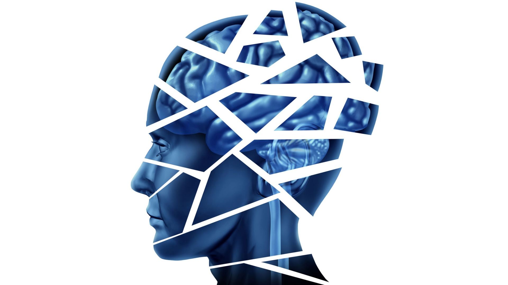

```{r setup, include=FALSE}
knitr::opts_chunk$set(echo = FALSE)
```



Many psychiatric drugs act on the receptors or transporters of certain neurotransmitters in the brain. However, there is a great need for alternatives, and research is looking at other targets along the brain's metabolic pathways. Lack of glycine betaine contributes to brain pathology in schizophrenia, and new research shows that betaine supplementation can counteract psychiatric symptoms in mice.

# Souce of the blog and words count :
Source: <https://www.sciencedaily.com/releases/2019/06/190626124940.htm> (06/26/2019)(Credits)

Words count : 436


# Vocabulary :

| Words from the text | Synonym/ definition in english                                                          | French translation |
| ------------------- | --------------------------------------------------------------------------------------- | ------------------ |
| alternatives        | more available possibilities                                                            | alternatives       |
| pathway             | a track that constitutes or serves as a path                                            | chemin          |
| alleviate           | reduce                                                                                  | soulager          |
| postmortem          | an examination of a dead body to determine the cause of death                           | autopsie       |
| subset              | a part of a larger group of related things                                              | sous-ensemble |
| adverse             | preventing success or development                                                       | négative   |


# Analysis table :

|                                      |                                                                                                                                                                                                                                                                                                                                                                                                                                                                                            |
| ------------------------------------ | ------------------------------------------------------------------------------------------------------------------------------------------------------------------------------------------------------------------------------------------------------------------------------------------------------------------------------------------------------------------------------------------------------------------------------------------------------------------------------------------ |
| Researchers                          | RIKEN Center for Brain Science (CBS)                                                                                                                                                                                                                                                                                                                                                                                                                                  |
| Published in ? when (if mentioned) ? | June 26, 2019                                                                                                                                                                                                                                                                                                                                                                                                                                                                              |
| General topic                        | Schizophrenia                                                                                                                                                                                                                                                                                                                                                                                                                                                                              |
| Procedure/ what was examined ?       | 1.Testing if betaine supplementation could help alleviate symptoms induced by PCP and methamphetamine in mice.
|                                      | 2.Investigation of postmortem human brain samples.                                                                                                                                                                                                                 |
| Conclusions/ discovery               | -Low levels of Betaine in the blood plasma might indicates the presence of shizophrenia.
|                                      | -Mices with low amount of the Chdh gene, that is involved in making betaine, showed depressive behaviors and greatly reduced betaine levels in both the brain and blood.
|                                      | -Psychedelic drugs like PCP and methamphetamine can also produce schizophrenia-like behaviors in both humans and mice.  
|                                      | -Finding that betaine not only improved cognitive deficits and behavioral abnormalities, it also reversed oxidative stress at the molecular level.
| Remained  questions ?                 | -                                                                                                                                                                                                                                                                                                                                            |
