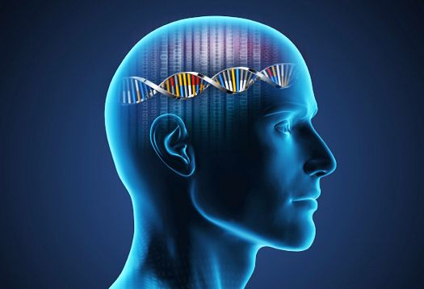

```{r setup, include=FALSE}
knitr::opts_chunk$set(echo = FALSE)
```




# Source of the blog and words count

Source : <https://www.sciencedaily.com/releases/2019/07/190703121445.htm>  (03/07/2019)
Number of words : 508

# Vocabulary


| Words from the text | Synonym/ definition in English | French translation |
| :-----------------: | :----------------------------: | :----------------: |
|     recrutement     |          enrolement            |    recruitment     |
|      screening      |           detecting            |     dépistage      |
|    predominantly    |           principaly           |   principalement   |
|      ancestry       |            heritage            |     ascendance     |
|    symmetrically    |          identically           |   symétriquement   |
|    computational    |         calculational          |       calcul       |
|      replicate      |           reproduce            |     reproduire     |
|        fund         |            finance             |      financer      |

# Analysis table


|                                      |                          |
| ------------------------------------ | :----------------------: |
| Researchers                          | University of Queensland |
| Published in ? when (if mentioned) ? |        03-07-2019        |
| General topic                        |      Schizophrenia       |
| Procedure / what was examined        |                          |
| Conclusions / discovery              |                          |
|                                      |                          |


